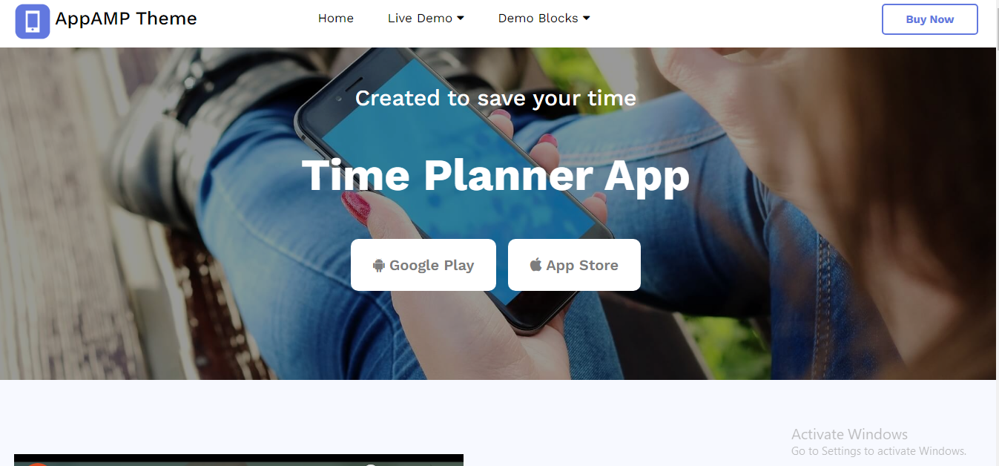

# TIME PLANNER APP

<h3> 📝📝 DESCRIPTION</h3>
  

It's an advance website .I used some beautiful hover effect with css in this project .I worked with advance level css and bootstrap in the website.but The website is not responsive .I didn't applied responsive css in the website because it's was my basic practice🙆‍♂️🙆‍♂️

<h3>🛠🛠 TOOLS</h3>
<ul>
  <li><h5>HTML5</h5></li>
  <li><h5>CSS3</h5></li>
  <li><h5>BOOTSTRAP</h5></li>
</ul>
  
### 🎨PREVIEW 

 <h3>🔗🔗LIVE PREVIEW LINK:</h3>

[SECOND WEB](https://sohaghossainpappu.github.io/second_web/)
